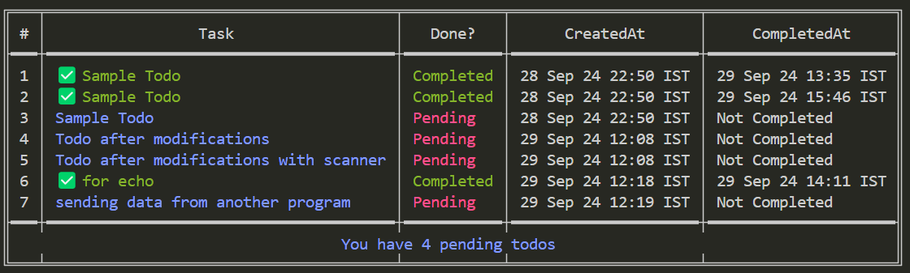

# Todo CLI Application

## Description

This is a Command-Line Interface (CLI) application designed to manage a simple todo list. The core features of this application include:

- Adding tasks with timestamps for creation and completion.
- Keeping track of the status of tasks (pending or completed).
- Deleting tasks.
- Listing all tasks along with their statuses (completed or pending) and timestamps.
- Monitoring the number of pending tasks.

## Installation

### Prerequisites

- [Golang](https://golang.org/) installed (version 1.23 or higher).

### Setup

Before running the application, you need to install the necessary dependencies listed in the `go.mod` file.

To install them, run the following command:

```bash
go mod tidy
```
## Usage
Navigate to the project directory in your terminal or command prompt. Use the following commands to interact with the todo CLI:

#### 1. Add a task:
```bash
  go run ./cmd/todo -add <task>
```
You can either provide the task as an argument or leave it empty, in which case the CLI will prompt you to input the task manually.

#### 2. Delete a task:
```bash
 go run ./cmd/todo -delete <task_id>
```
Replace <task_id> with the ID of the task you want to delete.

#### 3. Mark a task as completed:
```bash
 go run ./cmd/todo -complete <task_id>
```
Replace <task_id> with the ID of the task you want to mark as completed.

#### 4. List all tasks:
```bash
 go run ./cmd/todo -list
```
This will display all tasks (both completed and pending), along with their status and timestamps.

## Preview of Todo CLI 


## Example commands

```bash
# Add a task
go run ./cmd/todo -add "Buy groceries"

# Delete task with ID 2
go run ./cmd/todo -delete 2

# Mark task with ID 1 as completed
go run ./cmd/todo -complete 1

# List all tasks
go run ./cmd/todo -list

```
